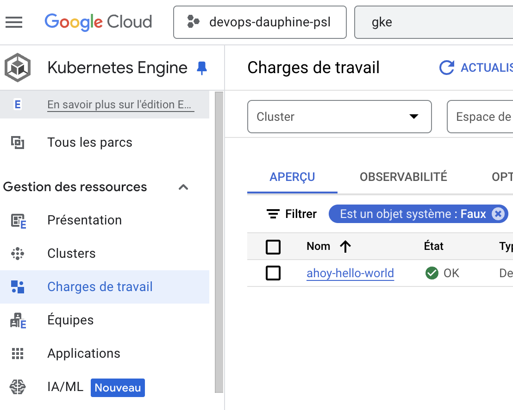
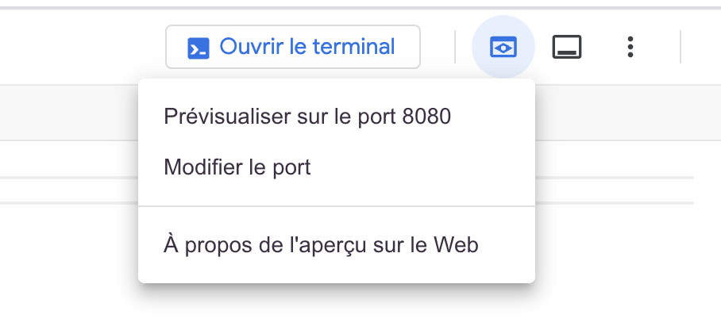
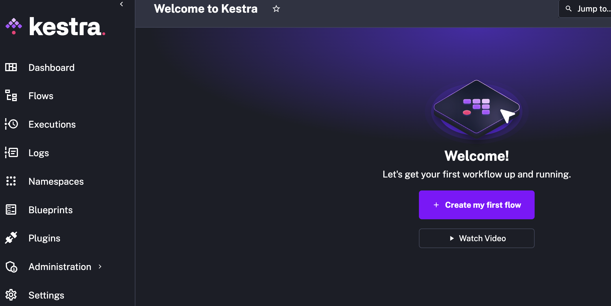

# TP 5 - Kubernetes

## Partie 1 : Helm chart

Nous allons déployer nginx avec un helm chart.

1. Créer un cluster GKE Autopilot, vous pouvez réutiliser le cluster de la partie 2 du TP 4 créé avec la commande suivante :

    ```bash
    gcloud container clusters create-auto helloworld-gke --location us-central1
    ```

2. Aller sur le repo git helm d'exemple https://github.com/helm/examples/tree/main
   Observer le contenu du dossier `charts/hello-world`

   Par défaut, quelle image est utilisée ? Le ReplicaCount est de combien ?

3. Deployer le chart avec les commandes suivantes :

    ```bash
    helm repo add examples https://helm.github.io/examples
    helm install ahoy examples/hello-world
    ```

    Quel est le nom de la release créée ?

    Quel est le nom du service créé ?

    Quel est le port exposé ?

    Vous pouvez utiliser la commande `kubectl get svc` pour récupérer le port exposé.
    Vous pouvez également inspecter les charges de travail déployées dans le cluster sur la console Google cloud en cherchant "Kubernetes Engine"
    

3. Créer un fichier `values.yaml` avec le contenu suivant :

    ```yaml
    replicaCount: 2
    ```

4. Mettez à jour le déploiement avec les commandes suivantes :

    ```bash
    helm upgrade --install ahoy examples/hello-world --values values.yaml
    ```

5. Inspecter le déploiement avec la commande `kubectl get deploy` et `kubectl get pods`

    Que remarquez-vous ?

6. Supprimer le déploiement avec la commande suivante :

    ```bash
    helm uninstall ahoy
    ```

## Partie 2 : Helm chart avec terraform

Nous allons déployer un nginx avec un helm chart en utilisant terraform. Vous pouvez consuler la documentation officielle de terraform pour le helm provider https://registry.terraform.io/providers/hashicorp/helm/latest/docs/resources/release

1. Créer les fichiers `providers.tf` et `main.tf` et copier le contenu des fichiers dans ce repo git.

2. Remplacer le `VOTRE_PROJET_GCP` par votre projet GCP dans le fichier `providers.tf`

3. Lancer le terraform init et le terraform apply

4. Pendant que le terraform est en cours d'exécution, lisez la documentation de la ressource `helm_release` https://registry.terraform.io/providers/hashicorp/helm/latest/docs/resources/release. Remarquez les différentes options que vous pouvez utiliser pour configurer le déploiement.

5. Récupérer le bon context kubernetes avec la commande `gcloud container clusters get-credentials <NOM_DU_CLUSTER> --region <REGION> --project <NOM_DU_PROJET>`

6. Inspecter le déploiement avec la commande `kubectl get deploy` et `kubectl get pods`

## Partie 3: Déploiement de grafana

1. Créer un fichier `grafana.tf` et copier le contenu du fichier depuis ce repo git.

2. Lancer le terraform init et le terraform apply

3. Inspecter le déploiement avec la commande `kubectl get deploy -n monitoring` et `kubectl get pods -n monitoring`

4. Accéder à grafana avec la commande suivante :

    ```bash
    kubectl get svc -n monitoring
    ```

    Récupérer l'adresse IP `EXTERNAL-IP` du service grafana et ouvrir un navigateur sur l'adresse IP.

5. Aller sur http://localhost:3000 et connectez-vous avec les identifiants admin/admin123

6. Regarder l'usage des ressources du déploiement Grafana du cluster dans l'interface Google Cloud.

## Partie 4 - Déploiement de Kestra, un orchestrateur de pipeline declaratif

Cette partie est optionnelle et volontairement moins guidée. Elle vous permettra de mettre en pratique les concepts vus à travers les TP précédents.

1. Pour commencer, lisez la documentation https://kestra.io/docs/getting-started/quickstart#start-kestra afin de comprendre comment déployer Kestra en local avec Docker.

Pour accéder à la console Kestra, vous pouvez utiliser "Aperçu Web" disponible dans cloud shell puis "Prévisualiser sur le port 8080".



Vous devriez voir la console Kestra.



2. Déployer Kestra dans votre cluster GKE Autopilot avec Terraform.

3. Créer une flow Kestra permettant de charger de la data dans BigQuery. Vous pouvez vous inspirer du template: https://kestra.io/blueprints/sensitive-data

Vous pouvez le faire avec docker ou kubernetes.

Sur docker / docker compose, vous pouvez suivre la documentation officielle https://kestra.io/docs/configuration#global-variables

Sur kubernetes, vous pouvez utiliser un Service Account dédié et passer la clé à Kestra dans les `values.yaml` sous forme de globals ou utiliser le workload identity pour accéder à BigQuery.

Dans le premier cas, vous pouvez passer la clé JSON dans les `values.yaml` en suivant https://kestra.io/docs/how-to-guides/kubernetes-secrets ou https://kestra.io/docs/configuration#global-variables. Bien entendu, vous pouvez créer le service account et le secret dans terraform.

Dans le second cas, vous pouvez suivre la documentation https://cloud.google.com/kubernetes-engine/docs/how-to/workload-identity?hl=fr et https://kestra.io/docs/installation/kubernetes-gcp-gke#workload-identity-setup.
